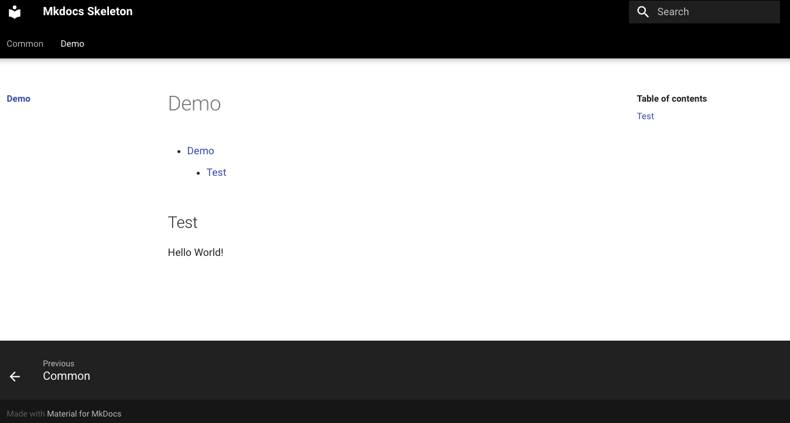

# mkdocs_skeleton



This repository provides you a mkdocs skeleton setup. This setup will install some basic features and will install the [Material Theme](https://squidfunk.github.io/mkdocs-material/).
There is also a reload feature enabled. Therefore you do not have to rebuild the container after every change.

### Clone repository

```
git clone https://github.com/andrekloster/mkdocs_skeleton.git
cd mkdocs_skeleton
```

### Start mkdocs through script

```
./mkdocs.sh start
```

### Stop mkdocs through script

```
./mkdocs.sh stop
```

### Open mkdocs inside your browser

```
http://EXTERNAL-DOCKERHOST-IP:8080
```
